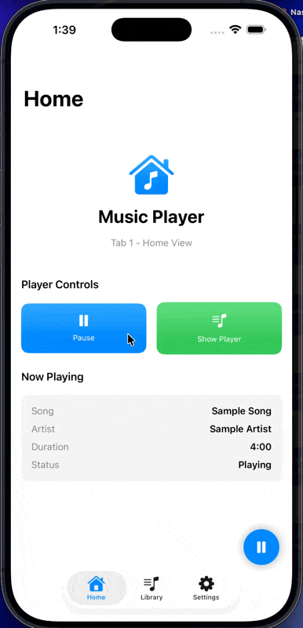

# FloatingPlayer

A customizable, floating audio player for SwiftUI applications. FloatingPlayer provides an elegant and intuitive way to add audio playback capabilities to your app with a floating interface that can be minimized or expanded based on user interaction.




## Features

- 🎵 **Floating Interface**: Draggable floating player that snaps to corners
- 🎨 **Highly Customizable**: Extensive configuration options for colors, typography, animations, and behavior
- 📱 **Cross-Platform**: Supports iOS, macOS, tvOS, watchOS, and visionOS
- 🔧 **Protocol-Based**: Easily integrate with your existing audio framework
- ⚡ **SwiftUI Native**: Built entirely in SwiftUI with modern Swift concurrency
- 🎛️ **Rich Controls**: Play/pause, seek, skip forward/backward, and favorite functionality
- 🎯 **Minimal Dependencies**: No external dependencies required

## Requirements

- iOS 17.0+ / visionOS 1.0+
- Swift 5.9+
- Xcode 15.0+

## Installation

### Swift Package Manager

Add FloatingPlayer to your project using Swift Package Manager:

1. In Xcode, go to **File** → **Add Package Dependencies**
2. Enter the repository URL: `https://github.com/essamsoft/FloatingPlayer`
3. Click **Add Package**

Or add it to your `Package.swift`:

```swift
dependencies: [
    .package(url: "https://github.com/essamsoft/FloatingPlayer", from: "1.0.0")
]
```

## Quick Start

### Basic Usage

```swift
import SwiftUI
import FloatingPlayer

struct ContentView: View {
    @State private var playerViewModel = FloatingPlayerViewModel()
    
    var body: some View {
        NavigationView {
            // Your main app content
            List {
                Text("Your app content here")
            }
            .navigationTitle("My App")
        }
        .floatingPlayer(viewModel: playerViewModel)
        .onAppear {
            // Load an audio item
            let audioItem = DefaultAudioItem(
                title: "Sample Song",
                artist: "Sample Artist",
                duration: 180
            )
            playerViewModel.play(item: audioItem)
        }
    }
}
```

### Custom Audio Integration

For real audio playback, implement the `FloatingPlayerAudioService` protocol:

```swift
import AVFoundation
import FloatingPlayer

@Observable
@MainActor
final class MyAudioService: FloatingPlayerAudioService {
    private var player: AVPlayer?
    
    var currentItem: (any AudioItem)?
    var isPlaying: Bool = false
    var currentTime: TimeInterval = 0
    
    func load(item: any AudioItem) {
        // Load your audio item into AVPlayer
        // Implementation details...
    }
    
    func play() {
        player?.play()
        isPlaying = true
    }
    
    func pause() {
        player?.pause()
        isPlaying = false
    }
    
    // Implement other protocol methods...
}

// Use your custom service
let customService = MyAudioService()
let playerViewModel = FloatingPlayerViewModel(audioService: customService)
```

### Custom Audio Items

Create your own audio item types by conforming to the `AudioItem` protocol:

```swift
struct Song: AudioItem {
    let id: String
    let title: String
    let artist: String
    let duration: TimeInterval
    let artworkURL: String?
    let albumName: String
    let genre: String
    
    var metadata: [String: Any] {
        ["album": albumName, "genre": genre]
    }
}
```

## Customization

FloatingPlayer is highly customizable through the `FloatingPlayerConfiguration`:

```swift
let customConfig = FloatingPlayerConfiguration(
    colors: ColorConfiguration(
        primary: .white,
        accent: .orange,
        background: .black.opacity(0.8)
    ),
    styling: StylingConfiguration(
        cornerRadius: 16,
        minimizedPlayerSize: CGSize(width: 72, height: 72)
    ),
    positioning: PositioningConfiguration(
        initialPosition: .topTrailing,
        snapToCorners: true
    ),
    playback: PlaybackConfiguration(
        skipInterval: 30,
        enableSkipControls: true,
        enableFavoriteButton: false
    )
)

// Apply the configuration
ContentView()
    .floatingPlayer(viewModel: playerViewModel, configuration: customConfig)
```

### Configuration Options

#### Colors
- Primary and secondary text colors
- Background and surface colors  
- Accent color for controls
- Fully customizable color scheme

#### Styling
- Corner radius for rounded corners
- Shadow configuration
- Player sizes for minimized and expanded states
- Typography settings

#### Positioning
- Initial position (corners or center)
- Automatic corner snapping
- Custom edge insets
- Drag behavior

#### Playback
- Skip interval duration
- Enable/disable specific controls
- Seek bar configuration
- Favorite button toggle

## Advanced Usage

### Callbacks and Events

```swift
playerViewModel.onPlaybackStateChanged = { isPlaying in
    print("Playback state changed: \(isPlaying)")
}

playerViewModel.onItemChanged = { item in
    print("Now playing: \(item?.title ?? "Nothing")")
}

playerViewModel.onFavoriteToggled = { item, isFavorite in
    // Save favorite status to your backend
    saveFavoriteStatus(for: item, isFavorite: isFavorite)
}
```

### Manual Control

```swift
// Control playback programmatically
playerViewModel.play()
playerViewModel.pause()
playerViewModel.seek(to: 0.5) // Seek to 50%
playerViewModel.skipForward(30) // Skip 30 seconds

// Control UI state
playerViewModel.showExpandedPlayer()
playerViewModel.hideExpandedPlayer()
```

## API Reference

### FloatingPlayerViewModel

The main view model for controlling the floating player.

#### Properties
- `isPlayerExpanded: Bool` - Whether the player is in expanded state
- `currentItem: (any AudioItem)?` - Currently loaded audio item
- `isPlaying: Bool` - Current playback state
- `currentTime: TimeInterval` - Current playback time
- `progress: Double` - Playback progress (0.0 to 1.0)

#### Methods
- `play(item:)` - Load and play an audio item
- `togglePlayback()` - Toggle between play and pause
- `seek(to:)` - Seek to specific time or progress
- `skipForward(_:)` / `skipBackward(_:)` - Skip by interval
- `showExpandedPlayer()` / `hideExpandedPlayer()` - Control UI state

### AudioItem Protocol

Protocol for defining playable audio items.

```swift
protocol AudioItem {
    var id: String { get }
    var title: String { get }
    var artist: String { get }
    var duration: TimeInterval { get }
    var artworkURL: String? { get }
    var metadata: [String: Any] { get }
}
```

### FloatingPlayerAudioService Protocol

Protocol for implementing custom audio playback services.

```swift
protocol FloatingPlayerAudioService: Observable {
    var currentItem: (any AudioItem)? { get }
    var isPlaying: Bool { get }
    var currentTime: TimeInterval { get }
    
    func load(item: any AudioItem)
    func play()
    func pause()
    func togglePlayback()
    func seek(to time: TimeInterval)
    func skipForward(_ seconds: TimeInterval)
    func skipBackward(_ seconds: TimeInterval)
}
```

## Example Projects

Check out the included sample app in `SampleApp.swift` for a complete example of how to integrate FloatingPlayer into your application.

## Contributing

Contributions are welcome! Please feel free to submit a Pull Request. For major changes, please open an issue first to discuss what you would like to change.

## License

FloatingPlayer is available under the MIT License. See the LICENSE file for more info.

## Support

If you have any questions or need help integrating FloatingPlayer, please:

1. Check the documentation and examples
2. Search existing issues on GitHub
3. Create a new issue with a detailed description

## Roadmap

- [ ] Background playback
- [ ] Lock screen controls
- [ ] Accessibility improvements
- [ ] Animation improvements

---

Made with ❤️ for the SwiftUI community
